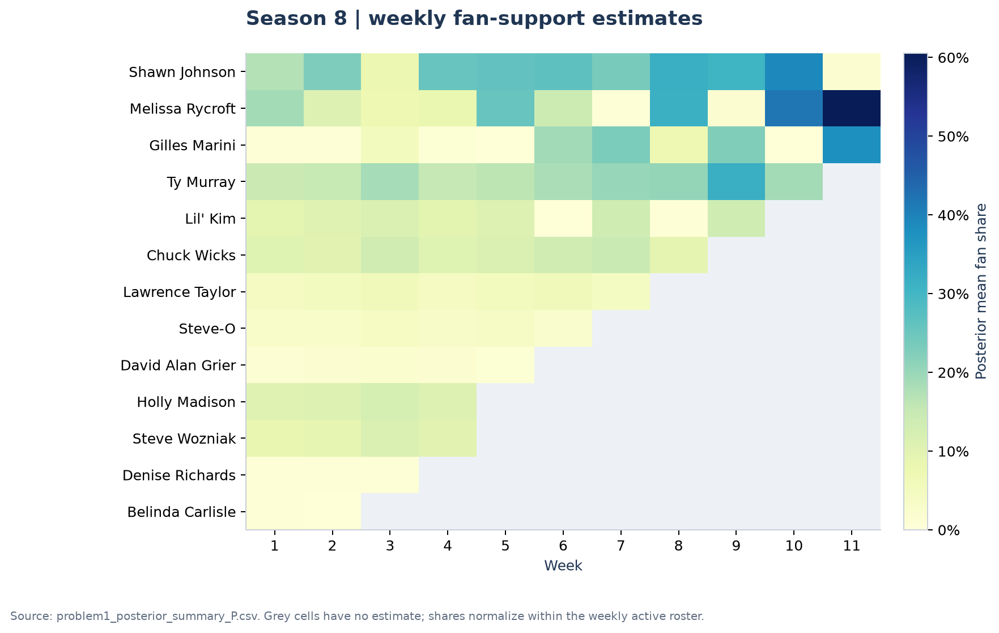

# 从淘汰结果到观众投票：DWTS 支持度推断与赛制设计

**2026 MCM Problem C · Meritorious Winner · Team 2623768**

在观众票数未公开的条件下，如何还原选手的支持度，并评估一套赛制如何改变比赛结果？本项目基于 *Dancing with the Stars* 的 **34 季、421 个选手—赛季观测**，完成了从比赛数据重建、潜在观众支持度估计，到投票规则回放、选手特征分析和赛制模拟的完整流程。

原方案在 **218 个单人淘汰周中重构了 207 次淘汰结果，重构率为 94.95%**。在 5 种赛制、51,000 条赛季路径的模拟中，新规则 V5 将评委前 3 名选手的淘汰频率相对 V4 基准**降低 49.7%**。项目同时实现边际似然模型作为对照，输出逐周支持度及可信区间。

[论文原文](paper.pdf) · [方法与公式](docs/METHODS.md) · [数据与文件说明](docs/DATA.md) · [结果解读](docs/RESULTS.md) · [复现方法](#快速复现)

## 项目完成了什么

| 环节 | 解决的问题 | 实现与产出 |
|---|---|---|
| 数据重建 | 原始宽表混合了评分缺失、赛后填零、退赛和决赛状态 | 重建 4,199 行选手—赛季—周面板，生成在赛名单与淘汰事件表 |
| 支持度推断 | 观众票数不可直接观测 | pooled softmin + Dirichlet 重要性采样，输出支持度后验均值、90% 可信区间和采样诊断 |
| 规则比较 | 同一组选手与支持度，在不同规则下会怎样 | 回放排名制、百分比制及 Bottom-2 评委拯救机制，比较赛季整体与 6 位争议选手 |
| 特征分析 | 评委评价与观众支持分别关联哪些因素 | 选手属性、舞伴历史表现、赛季固定效应、HC3 标准误及按赛季前向验证 |
| 赛制设计 | 如何平衡技术表现与观众参与 | 5 种规则、每种规则每季 300 次模拟，输出生存表现、淘汰路径和技术冲击指标 |
| 稳健性分析 | 结论对参数与样本组成有多敏感 | 温度与集中度、正则化比例、评委信号变换、逐季剔除重估四组检验 |

## 主要结果

### 1. 以淘汰结果为约束，重建逐周观众支持度

| 指标 | P：原方案 | R：边际似然对照 |
|---|---:|---:|
| 单人淘汰周重构数 | **207 / 218** | 182 / 218 |
| 样本内淘汰重构率 | **94.95%** | 83.49% |
| 后验加权一致概率 PCP | 0.6043 | 0.5342 |
| 平均相对可信区间宽度 | 3.117 | 3.378 |
| 赛季路径一致性均值 | 0.7785 | 0.6331 |

P 保留原方案的“两阶段拟合—逐周更新”；R 将观众支持度积分出似然后估计参数，并采用题面给出的规则年代划分。两种实现共享数据处理、后验汇总与规则回放，便于追踪建模选择对结果的影响。


除整体指标外，仓库保留每位选手每周的估计及区间，能够进一步回答“谁的支持度较高”“哪一周估计更稳定”等问题。第 8 季的支持度轨迹如下：



### 2. 将赛制差异落实到具体选手与淘汰路径

两种基础规则的赛季平均后验分歧率为 **44.05%**。观众支持改变评委单独排序下淘汰选择的比例，在百分比制下为 **71.15%**、排名制下为 **47.28%**，相差 **23.87 个百分点**。

规则回放同时计算排名制和百分比制，再加入“综合表现最低两人中，由评委保留技术表现更好者”的机制。分析覆盖 Jerry Rice、Billy Ray Cyrus、Bristol Palin、Bobby Bones、Tinashe 和 Vinny Guadagnino 六个案例。

比较使用统一的观众支持度输入，输出规则分歧、评委拯救反转、逐周淘汰概率和选手路径变化。每一个展示结果都对应可直接查看的 CSV 表。


### 3. 分别刻画技术评价与观众支持的关联因素

以选手年龄、行业、舞伴历史成绩及参赛经验构建回归模型，并分别解释评委信号与观众信号。舞伴历史特征只汇总当前赛季以前的信息；赛季固定效应用于吸收不同赛季的共同差异。

结果显示，年龄与评委标准化评价呈稳定负向关联；观众支持具有不同的属性关联结构。这使“技术表现”和“人气”能够作为两个维度分别分析，也为规则权重设计提供了依据。


### 4. 用完整赛季模拟检验新规则

两组模拟分别比较娱乐导向机制与技术表现导向机制。后者对观众支持做幂变换，对评委信号做强化，并结合近期表现奖励与 Bottom-2 评委拯救。

模拟将每条规则落实为实际淘汰顺序，记录选手存活情况、争议案例与技术表现靠前选手被淘汰的频率。**V5 将评委前 3 名被淘汰的频率从 V4 的 12.06% 降至 6.07%**；Bobby Bones 的末周模拟留存率从 26.67% 降至 2.67%。整体指标与案例变化共同展示了新规则对技术表现的保护效果。


完整数值、指标定义及参数敏感性见[结果解读](docs/RESULTS.md)。

## 建模思路

```text
赛题原始数据
    │
    ├─ 清理结构性零值、解析赛季结果
    └─ 重建每周在赛名单与淘汰事件
           │
           ├─ P：拟合支持度中心 → Dirichlet 后验更新
           └─ R：积分观众支持度 → 边际似然估计 → 后验更新
                         │
                         ├─ 排名 / 百分比 / Bottom-2 规则回放
                         ├─ 赛制模拟与争议选手分析
                         └─ 参数扰动与逐季剔除重估

随附选手特征表 → 属性回归、舞伴历史特征、前向验证
```

在每个赛季的每一周，先把观众支持度写成总和为 1 的向量。用评委信号、赛制年代、年龄和选手—赛季效应拟合支持度中心，再用 Dirichlet 分布描述周与周之间的变化。观测到的淘汰结果通过 softmin 似然约束这些可能的支持度分配。

P 与 R 分别提供原方案及其边际化实现；规则比较和机制模拟建立在这些支持度估计上。主要超参数集中在 [`configs/problem1.yaml`](configs/problem1.yaml)，完整符号、似然、评价指标及规则公式见[方法说明](docs/METHODS.md)。

## 快速复现

仓库随附原始 CSV、用于回归与选手分型的中间表，以及本次运行生成的结果。克隆后即可运行，无需配置本机绝对路径。

### 安装

使用 Python 3.13 或更新版本。

```bash
git clone https://github.com/jerryli12sh/MCM2026-Problem-C.git
cd MCM2026-Problem-C
python3 -m venv .venv
source .venv/bin/activate
python -m pip install -r requirements.txt
python -m pip install -e . --no-deps
```

Windows 将激活命令替换为 `.venv\Scripts\activate`。本次验证环境为 Python 3.13；依赖版本记录在 `requirements.txt`。

### 先跑核心模型

```bash
python scripts/reproduce.py --core
```

这一步从原始数据重建周面板，再拟合 P 模型，生成 `results/tables/problem1_summary_P.json`、逐周支持度、可信区间和重构结果。

### 运行完整分析

```bash
python scripts/reproduce.py
```

依次运行数据处理、P/R 模型、基线比较、两组规则回放、属性回归、赛制模拟、敏感性分析和绘图。程序打印当前阶段；本次本机完整运行约 24 分钟，其中赛制模拟约 14 分钟，实际耗时取决于机器。

### 单独运行某一部分

```bash
python scripts/reproduce.py --stage model-r
python scripts/reproduce.py --stage rules-p
python scripts/reproduce.py --stage regression
python scripts/reproduce.py --stage simulation
python scripts/reproduce.py --stage sensitivity
python scripts/reproduce.py --stage figures
```

`rules-p`、`rules-r` 与 `simulation` 读取相应模型的拟合文件。首次运行这些阶段前，先运行 `--core` 或完整流程；R 的规则回放还需要 `model-r`。拟合数组 `.npz` 在本地生成，仓库展示使用便于阅读的 CSV 和 JSON。

### 检查程序

```bash
python -m pip install -e '.[dev]'
pytest
```

本次完整运行后 **179 项测试全部通过**；从仅含发布文件的独立目录运行核心模型，关键指标与完整运行一致。测试覆盖在赛名单、退出状态、概率归一化、拟合梯度、规则并列处理、模拟一致性和关键结果。涉及拟合数组的测试在模型运行后执行；其余测试可直接在新克隆中运行。

## 目录结构

```text
MCM2026-Problem-C/
├── README.md                 项目概览、主要成果、运行方法
├── paper.pdf                 比赛论文原件
├── configs/                  模型参数
├── data/
│   ├── 2026_MCM_Problem_C_Data.csv
│   ├── intermediate/         周面板、在赛名单、回归特征、选手分型
│   └── reference/            原分析的小型数值对照表
├── src/dwts_reproduction/
│   ├── preprocess.py         统一数据处理
│   ├── problem1/             支持度推断与评价
│   ├── problem2/             规则回放
│   ├── problem3/             属性与舞伴分析
│   ├── problem4/             赛制模拟
│   └── sensitivity/          稳健性分析
├── scripts/                  一键运行与分阶段入口
├── results/
│   ├── figures/              README 中的结果图
│   └── tables/               逐周结果、统计汇总和模型参数
├── docs/                     方法、数据、结果说明
├── tests/                    数值与模型逻辑测试
├── pyproject.toml            包与依赖配置
└── requirements.txt          本次验证的依赖版本
```

最直接的结果入口：

| 想看什么 | 文件 |
|---|---|
| 总体重构结果 | [`problem1_summary_P.json`](results/tables/problem1_summary_P.json) |
| 每周估计及可信区间 | [`problem1_posterior_summary_P.csv`](results/tables/problem1_posterior_summary_P.csv) |
| 218 周逐条核对 | [`problem1_top1_by_week_P.csv`](results/tables/problem1_top1_by_week_P.csv) |
| 争议选手的规则差异 | [`problem2_case_divergence_P.csv`](results/tables/problem2_case_divergence_P.csv) |
| 属性回归系数 | [`problem3_demo_coefs_P3.csv`](results/tables/problem3_demo_coefs_P3.csv) |
| 赛制模拟案例 | [`problem4_case_summary_V2.csv`](results/tables/problem4_case_summary_V2.csv) |
| 四类敏感性分析 | [`sensitivity_summary_all_SA.csv`](results/tables/sensitivity_summary_all_SA.csv) |

## 结果口径与数据来源

本项目研究的是**历史重构与规则模拟**。94.95% 使用单人淘汰周计算；观众支持度为模型后验估计，回归刻画变量关联，赛制比较使用固定模型下的模拟结果。逐季剔除用于检验样本组成的稳定性。各指标的样本、分母、计算方式和原论文结果对照统一列在[方法](docs/METHODS.md)及[结果](docs/RESULTS.md)中。

原始数据来自 [COMAP 2026 MCM Problem C](https://www.contest.comap.com/undergraduate/contests/mcm/contests/2026/problems/2026_MCM_Problem_C.pdf)；[官方 CSV 下载](https://www.contest.comap.com/undergraduate/contests/mcm/contests/2026/problems/2026_MCM_Problem_C_Data.csv)。随附中间表来自本项目原分析，生成与使用关系见[数据说明](docs/DATA.md)。

论文为团队比赛成果；当前仓库将建模程序整理为统一的 Python 分析包，并补齐可运行入口、结果表和图示。原论文保留比赛提交时的内容，本次重新运行的数值以 `results/` 和对应文档为准。赛题与原始数据版权归 COMAP，项目代码和论文用于学习、研究与成果展示；引用时请注明来源。
