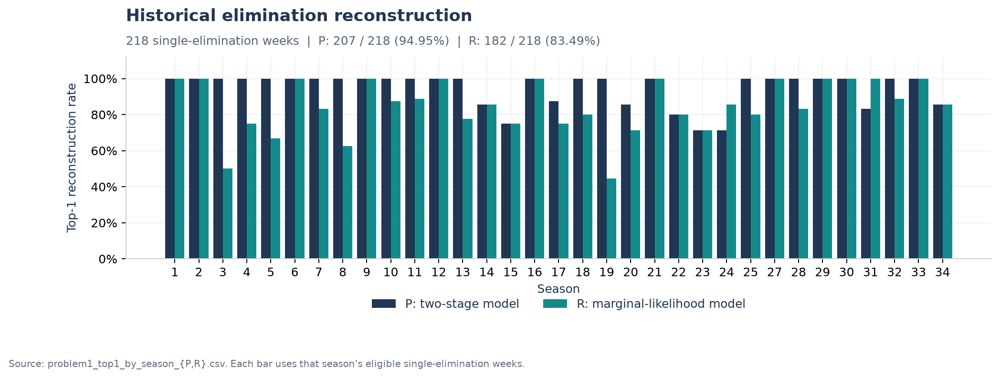
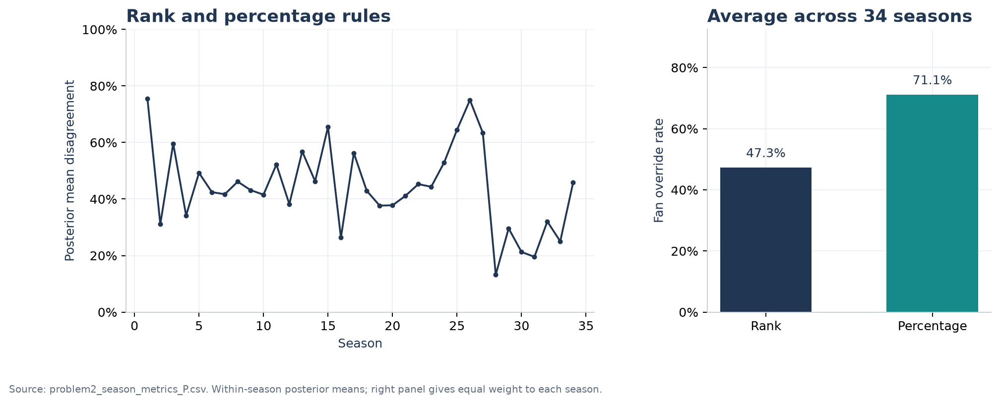
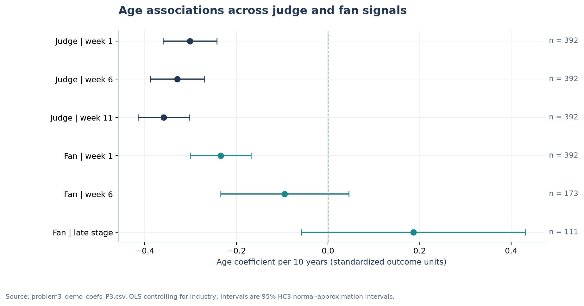
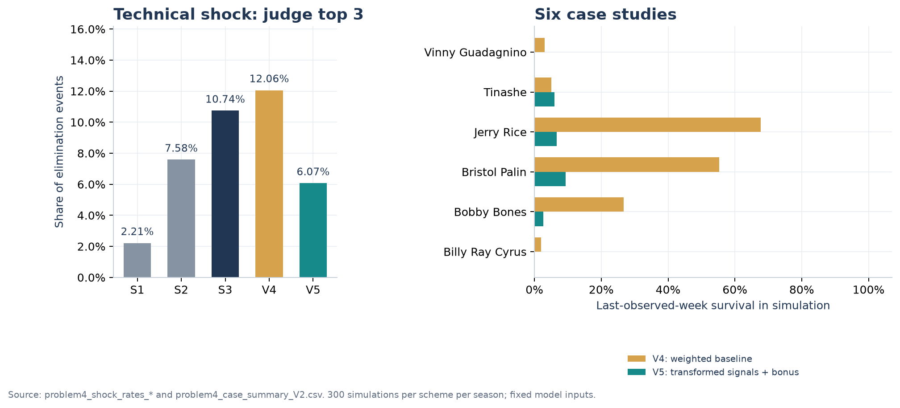
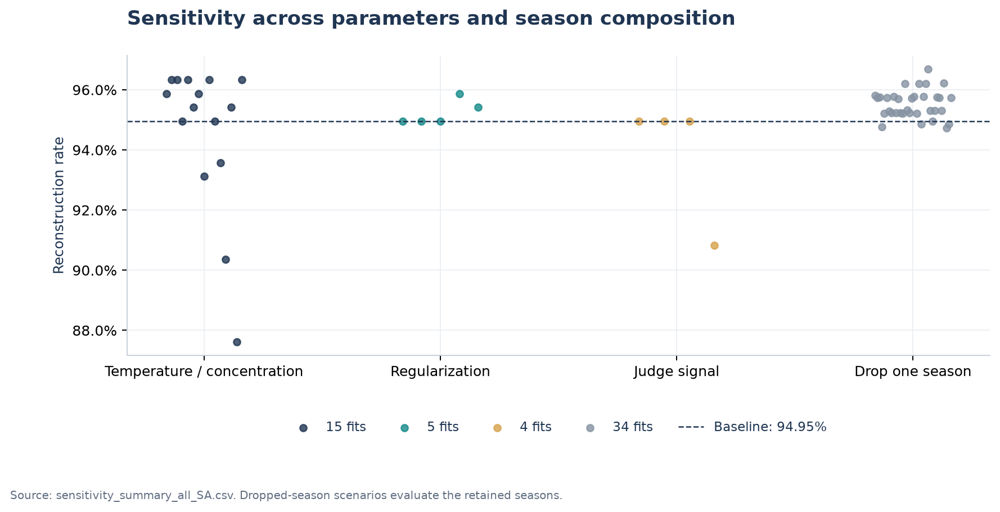

# 结果解读

本页串联总体重构、赛制比较、属性分析、机制模拟和稳健性结果。展示数值来自仓库内的 CSV/JSON，表格链接可用于查看样本与逐条计算结果。

## 1. 数据与总体重构

| 项目 | 数量 |
|---|---:|
| 比赛赛季 | 34 |
| 原始选手—赛季观测 | 421 |
| 选手—赛季—周面板 | 4,199 |
| 支持度估计记录 | 2,780 |
| 正常单人淘汰周 | 218 |
| 属性分析样本 | 392 |

P 模型在单人淘汰周中完成 **207/218 = 94.95%** 的历史重构，R 模型为 **182/218 = 83.49%**。P 的平均后验加权 PCP 为 0.6043，有效采样比例为 96.25%；R 的对应值为 0.5342 和 97.99%。

这些结果同时体现了两项产出：一是对淘汰结果的整体还原，二是带有采样诊断和区间估计的周支持度分布。后者支持进一步分析规则变化，而不仅输出一个选手排名。

数据：[P 汇总](../results/tables/problem1_summary_P.json)、[R 汇总](../results/tables/problem1_summary_R.json)、[逐周重构](../results/tables/problem1_top1_by_week_P.csv)、[逐周后验](../results/tables/problem1_posterior_summary_P.csv)。90% 可信区间使用后验的 5% 与 95% 加权分位数。Top-1 按周平均，PCP 的首页汇总按选手—周加权，计算细节见[方法说明](METHODS.md)。

## 2. 规则选择会改变淘汰结果

使用 P 模型的支持度，先在每季内计算指标，再对 34 季等权平均：

| 指标 | 结果 |
|---|---:|
| 排名制与百分比制的淘汰分歧率 | **44.05%** |
| 排名制：淘汰者不同于评委最低评分者 | 47.28% |
| 百分比制：淘汰者不同于评委最低评分者 | 71.15% |
| 两种规则的观众影响差异 | **23.87 个百分点** |
| 排名制：淘汰观众支持最低者 | 23.17% |
| 百分比制：淘汰观众支持最低者 | 56.39% |

百分比制保留了份额差距，让高人气带来的优势更充分地进入综合分数；排名制将这种差距压缩为名次。结果为赛制选择提供了清晰的设计取舍：调整组合方式，本身就能改变观众支持对结果的影响强度。

数据：[赛季规则指标](../results/tables/problem2_season_metrics_P.csv)。这里使用表中的 `posterior_mean`，按原分析的抽样汇总口径计算；逐周重要性加权的版本另存于 [`problem2_agree_week_P.csv`](../results/tables/problem2_agree_week_P.csv)。

### 六位争议选手

| 选手 | 赛季 | 观众与评委平均名次差 | 该季最大规则翻转比例 |
|---|---:|---:|---:|
| Jerry Rice | 2 | −3.69 | 87.17% |
| Billy Ray Cyrus | 4 | −3.25 | 74.83% |
| Bristol Palin | 11 | −4.30 | 97.00% |
| Bobby Bones | 27 | −4.00 | 57.50% |
| Tinashe | 27 | +8.50 | 57.50% |
| Vinny Guadagnino | 31 | −9.88 | 32.83% |

名次差定义为“观众名次 − 评委名次”：负值表示观众评价更靠前，正值表示评委评价更靠前。该季最大规则翻转比例 `Flip` 是全季合格周中两种规则选择不同淘汰者的最大抽样比例，因此同季选手共享这一列。选手自身的逐周概率见[案例周表](../results/tables/problem2_case_weekly_probs_P.csv)。

数据：[案例差异表](../results/tables/problem2_case_divergence_P.csv)、[Bottom-2 指标](../results/tables/problem2_b2_metrics_P.csv)。

## 3. 技术评价与人气具有不同的属性关联

控制职业类别后，年龄每增加 10 岁，评委标准化信号的回归系数在三个阶段分别为 **−0.301、−0.329、−0.359**。观众信号的关联随阶段变化：第 1 周为 −0.234，第 6 周为 −0.094，末期为 +0.186，各阶段区间宽度也有明显差异。

图中区间为基于 HC3 标准误的 95% 正态近似区间。评委阶段特征使用截至对应周的最近有效评分；观众特征按可用观测选样。第 1 周、评委阶段、观众第 6 周和末期的样本量分别在图中列出。

动态关联模型进一步得到：中期 Surprise 对 Growth 的线性系数为 **0.342**，二次项为 **0.182**，对应结果表保留系数、标准误与 p 值。舞伴经验、过去成绩及固定效应的结果则分别列在相关表中。

数据：[属性系数](../results/tables/problem3_demo_coefs_P3.csv)、[完整模型摘要](../results/tables/problem3_ols_summary_P3.csv)、[前向验证](../results/tables/problem3_cv_forward_P3.csv)、[动态模型](../results/tables/problem3_surprise_quadratic_tw6_P3.json)。

本次整理将最终名次映射回官方 `placement` 列，并按实际历史参赛次数计算舞伴胜率和前三率。这两处统一使名次解释和历史特征计算保持一致。评委与观众阶段信号保留原分析口径，具体入口见[数据说明](DATA.md)。

## 4. 赛制模拟

在固定拟合模型下，对 5 种规则、34 个赛季各模拟 300 次，形成 **51,000 条赛季路径**。

| 规则 | 评委前 3 名淘汰频率 |
|---|---:|
| S1：排名合成 + Bottom-2 | 2.21% |
| S2：阶段切换 | 7.58% |
| S3：全程评委提名池 | 10.74% |
| V4：固定份额加权 | 12.06% |
| V5：信号变换 + 近期表现奖励 | **6.07%** |

V5 相对 V4 降低 **5.99 个百分点，降幅 49.7%**。案例层面，Jerry Rice 的末周模拟留存率由 67.67% 降至 6.67%，Bristol Palin 由 55.33% 降至 9.33%，Bobby Bones 由 26.67% 降至 2.67%；Tinashe 则由 5.00% 提升至 6.00%。S1 的技术冲击最低，也说明不同规则对应不同的参与方式与权重取舍。

左图比较 `Shock_3`：每次淘汰事件中，被淘汰者位于评委前 3 名的比例。右图比较 V4/V5 两种规则下六位案例的末周留存。V5 通过压缩极端观众份额、强化评委信号及奖励近期表现，将技术表现更明确地纳入结果。

数据：[第一组技术冲击](../results/tables/problem4_shock_rates_V1.csv)、[第二组技术冲击](../results/tables/problem4_shock_rates_V2.csv)、[V2 案例汇总](../results/tables/problem4_case_summary_V2.csv)、[V2 逐周案例](../results/tables/problem4_case_weekly_V2.csv)。规则的完整定义见[方法说明](METHODS.md)。

## 5. 参数与样本稳定性

58 组扰动覆盖四类设置：

| 扰动类型 | 设置数 | 历史重构率范围 |
|---|---:|---:|
| 温度与集中度 | 15 | 87.61%–96.33% |
| 正则化比例 | 5 | 94.95%–95.87% |
| 评委信号变换 | 4 | 90.83%–94.95% |
| 逐季剔除重估 | 34 | **94.74%–96.68%** |

逐季剔除后的支持度与基准估计保持较高相关性，Spearman 相关系数最低为 **0.9941**。模型对赛季组成和正则化比例较稳定；温度、集中度与评委信号变换对重构率的影响更明显，提供了参数选择的重点。

每个点代表一组重新拟合或重新推断的设置，横向分为集中度/温度、正则化、评委信号变换、逐季剔除四组。虚线给出基准设置，用于观察哪个环节对重构结果更敏感。

逐季剔除重估使用保留赛季评价，检验样本组成变化；参数组同时保留 PCP、支持度相关性和区间宽度。完整数字见[敏感性汇总](../results/tables/sensitivity_summary_all_SA.csv)，参数取值见[运行参数](../results/tables/sensitivity_run_config_SA.json)。

## 6. 与原论文的对应

原论文提供比赛期间的建模论证；当前仓库提供可执行实现与重新计算的结果。原方案的 94.95% 重构率、六位选手的主要差异指标和年龄关联得到重建。重新计算同时给出以下精确口径：

| 项目 | 当前计算结果 | 文档采用的解释 |
|---|---|---|
| XGBoost 季内基线 | 0.8211 | 保存逐周结果，按当前实现报告；论文记录为 0.806554 |
| 排名差异二次拟合 | $R^2=0.2704$，n=421 | 作为描述性关系，记录当前样本的解释度 |
| 支持度后验区间 | 90% 等尾加权区间 | 与代码中的 0.05/0.95 分位数一致 |
| P/R 并列 | 同时改变估计方式和年代映射 | 展示两套完整实现的结果 |
| 回归名次与舞伴历史率 | 统一官方名次及实际历史次数 | 当前属性分析的计算口径 |

XGBoost 的随附数值来自 macOS Apple silicon 环境；固定依赖、平台与随机种子后逐周结果可重复。其跨平台抽样与浮点差异见 [XGBoost 复现说明](https://xgboost.readthedocs.io/en/stable/tutorials/dask.html#reproducible-result)。自动测试验证固定种子的逐周复现与基线比较，计算线程固定为 1。

## 7. 运行与验证

数值运行日期：2026-10-08。环境为 Python 3.13，所用版本见 [`requirements.txt`](../requirements.txt)。完整入口为 `python scripts/reproduce.py`，会重建中间表并覆盖结果目录中的分析文件。本次 10 个阶段完整运行用时 1,412.6 秒（约 24 分钟）。

验证结果：**179 项测试全部通过**，代码规范检查通过；独立发布目录的核心复现与本次完整流程的关键指标完全一致。测试覆盖数据状态、概率归一化、梯度、规则并列、模拟逻辑及官方名次映射。仓库的自动检查会重新拟合 P/R 并运行测试；完整 51,000 路径模拟可由一键流程在本地完成。
